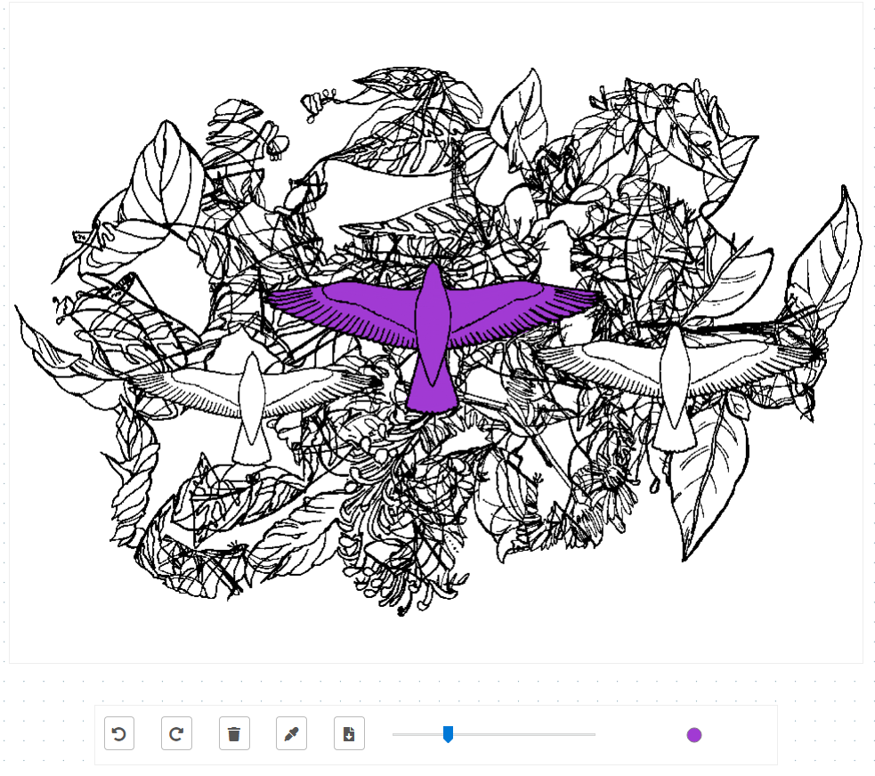

# Digital Coloring Book

### Overview

This is a digital coloring book I created to showcase my digital art.

#### Demo

Check the coloring book out [here](http://slaton.info/projects/existential-exploration/index.html).

#### Usage

##### Choosing an Image

Click on the images in the carousel at the top of the page to draw them to the canvas for coloring.

##### Changing the Brush Size

Use the slider to adjust your brush size.

##### Selecting a Color

Click on the brush preview circle (next to the size slider) to select a color.

##### Color Picker

Click on the eyedropper icon and then anywhere on the canvas to select a color you've already used.

##### Using your own images

Replace the images in the carousel div with pngs with transparent backgrounds and you're good to go! The images are drawn on a second canvas that sits above the canvas the user draws on.

### Acknowledgements

This project wouldn't be possible without the following resources.

[Theisen Sanders' Responsive Sketchpad](https://github.com/tsand/responsive-sketchpad)

[Simonwep's Color Picker Library 'pickr'](https://github.com/Simonwep/pickr)

[Ken Wheeler's Carousel Library 'slick'](https://github.com/kenwheeler/slick/)

[skeleton.js](http://getskeleton.com/)

[Dot Grid Pattern from Darius Garza](https://www.toptal.com/designers/subtlepatterns/dot-grid-pattern/)
